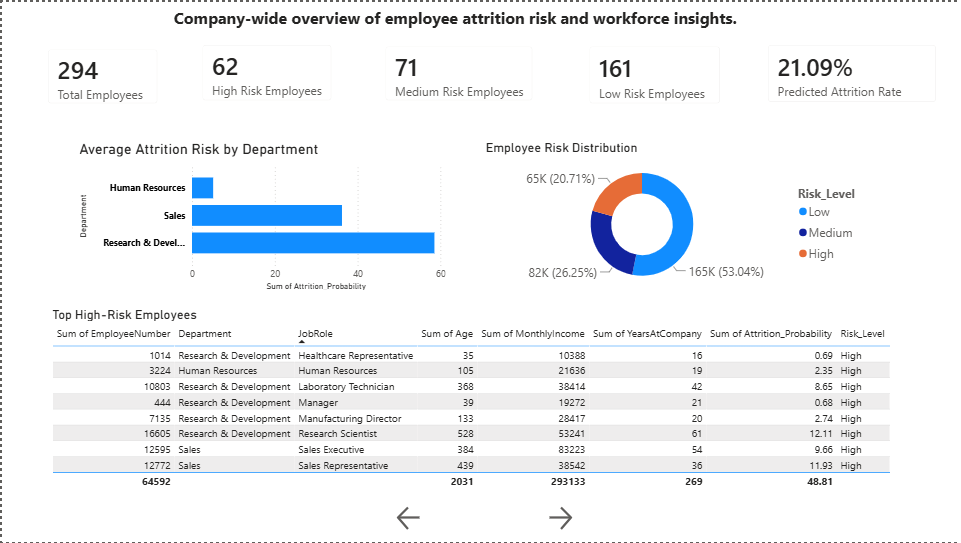
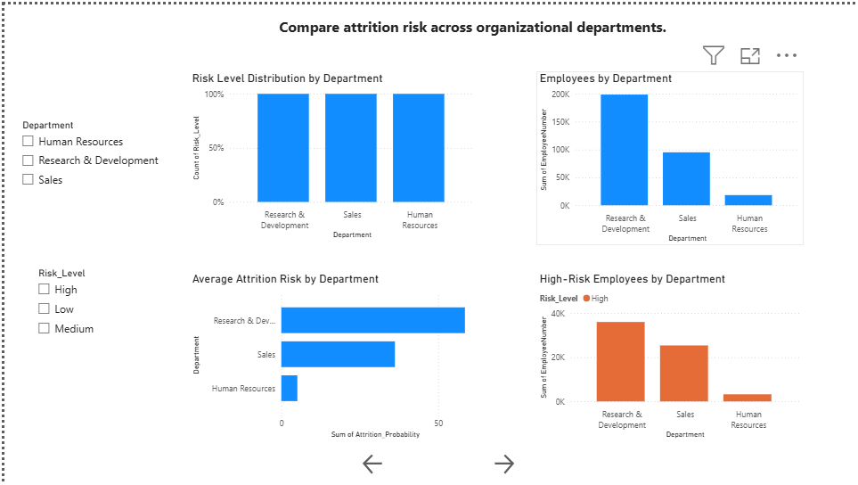
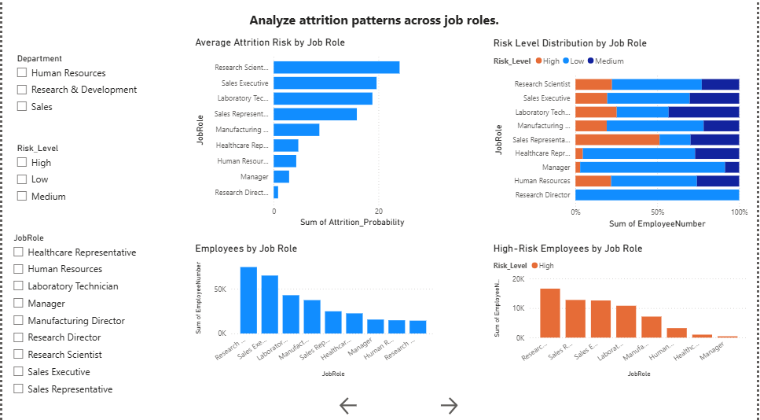

# Employee Attrition Intelligence System
### HR Analytics | SQL | Power BI | Machine Learning | Decision Support Dashboard

> An end-to-end HR Analytics project that combines **SQL, Python, Machine Learning, and Power BI** to identify employee attrition risk, analyze workforce trends, and provide actionable business recommendations through an interactive executive dashboard.

---

# Dashboard Preview


images/executive_dashboard.png


---

# Project Overview

Employee attrition is one of the most significant workforce challenges organizations face. High employee turnover increases recruitment costs, reduces productivity, and impacts organizational performance.

This project develops an **Employee Attrition Intelligence System** that helps HR teams identify employees at risk of leaving, analyze workforce patterns, monitor key HR KPIs, and support data-driven retention strategies.

Unlike traditional machine learning projects that stop at prediction, this project emphasizes **business analytics and decision support** by integrating:

- SQL business analytics
- HR KPI reporting
- Power BI dashboards
- Predictive risk scoring
- Executive-level insights

---

# Business Problem

HR departments often rely on historical reports rather than predictive analytics.

Key business questions include:

- Which employees are most likely to leave?
- Which departments have the highest attrition risk?
- Which job roles require immediate retention efforts?
- How can HR prioritize intervention strategies?
- Which workforce metrics should executives monitor regularly?

This project answers these questions using an analytics-first approach.

---

# Project Objectives

- Clean and prepare HR employee data
- Perform exploratory data analysis (EDA)
- Engineer predictive features
- Build an employee attrition prediction model
- Generate employee-level attrition risk scores
- Perform business-focused SQL analytics
- Develop an interactive Power BI dashboard
- Deliver actionable HR recommendations

---

# Dataset

IBM HR Analytics Employee Attrition Dataset

The dataset contains employee demographic, job, compensation, satisfaction, performance, and employment history information used for predictive analytics.

Key attributes include:

- Age
- Department
- Job Role
- Monthly Income
- Years at Company
- Job Satisfaction
- Work-Life Balance
- Overtime
- Environment Satisfaction
- Performance Rating
- Attrition

---

# Technology Stack

## Programming & Analytics

- Python
- Pandas
- NumPy
- Scikit-learn

## Data Visualization

- Matplotlib
- Seaborn
- Power BI

## Database

- SQL

## Development Environment

- Jupyter Notebook
- VS Code
- Git
- GitHub

---

# Project Workflow

```
Raw HR Dataset
        │
        ▼
Data Cleaning
        │
        ▼
Exploratory Data Analysis
        │
        ▼
Feature Engineering
        │
        ▼
Machine Learning Model
        │
        ▼
Employee Risk Scoring
        │
        ▼
SQL Business Analytics
        │
        ▼
Power BI Dashboard
        │
        ▼
Business Insights & Decision Support
```

---

# Machine Learning

A Logistic Regression classification model was developed to estimate the probability of employee attrition.

The predicted probability was transformed into business-friendly risk categories:

| Risk Level | Probability |
|------------|------------|
| High | ≥ 0.60 |
| Medium | 0.30 – 0.59 |
| Low | < 0.30 |

The resulting risk scores are used throughout the Power BI dashboard for HR analysis and decision-making.

---

# SQL Analytics

Business-oriented SQL queries were developed to answer common HR analytics questions.

Examples include:

- Average attrition risk by department
- Average attrition risk by job role
- High-risk employee identification
- Employee count by risk category
- Department-level risk comparison
- Top employees with highest predicted attrition probability
- Workforce KPI reporting

---

# Power BI Dashboard

The project includes a fully interactive Power BI dashboard consisting of multiple analytical views.

## Executive Summary

- Project overview
- Key findings
- Business recommendations

## Executive Dashboard

- Total Employees
- High Risk Employees
- Medium Risk Employees
- Low Risk Employees
- Average Risk Score
- Department comparison
- Risk distribution
- Top high-risk employees

## Department Analytics

- Department filters
- Risk distribution
- Employee counts
- Department comparison

## Job Role Analytics

- Job role comparison
- Attrition risk by role
- Employee distribution

## Employee Risk Explorer

- Interactive employee filtering
- Employee-level risk analysis
- Age-group comparison
- Workforce exploration

---

# Dashboard Preview

## Executive Dashboard



## Department Analytics



## Job Role Analytics



## Employee Risk Explorer


---

# Key Business Insights

- Sales department exhibits the highest average attrition risk.
- Sales Representatives represent the highest-risk job role.
- Research & Development contains the largest number of high-risk employees due to workforce size.
- Approximately one-fifth of employees are classified as High Risk.
- Attrition risk is concentrated among specific workforce segments, enabling targeted retention planning.

---

# Business Recommendations

- Prioritize retention strategies for Sales employees.
- Conduct stay interviews with high-risk employees.
- Monitor employees with elevated attrition probabilities.
- Improve career progression opportunities for high-risk job roles.
- Develop department-specific retention initiatives using dashboard insights.
- Continuously monitor workforce KPIs using the interactive Power BI dashboard.

---

# Skills Demonstrated

### Data Analytics

- Data Cleaning
- Exploratory Data Analysis
- Feature Engineering
- Business Analytics
- KPI Development

### SQL

- Aggregations
- GROUP BY
- Business KPI Queries
- Filtering
- Ordering
- Analytical Reporting

### Machine Learning

- Classification
- Logistic Regression
- Model Evaluation
- Risk Scoring

### Power BI

- Interactive Dashboards
- DAX Measures
- KPI Cards
- Slicers
- Charts
- Drill-down Analysis
- Dashboard Navigation

### Business Intelligence

- Workforce Analytics
- HR Analytics
- Decision Support
- Executive Reporting
- Business Recommendations

---

# Project Structure

```
employee-attrition-intelligence-system/

├── data/
│   ├── raw/
│   ├── cleaned/
│   └── processed/
│
├── notebooks/
│   ├── 01_data_cleaning.ipynb
│   ├── 02_eda.ipynb
│   ├── 03_feature_engineering.ipynb
│   ├── 04_model_building.ipynb
│   ├── 05_risk_scoring.ipynb
│   ├── 06_sql_analytics.ipynb
│   └── 07_powerbi_dashboard.ipynb
│
├── dashboards/
│   └── Employee_Attrition_Dashboard.pbix
│
├── images/
│
└── README.md
```

---

# Key Outcomes

- End-to-end analytics solution
- Predictive employee risk scoring
- Business-focused SQL analytics
- Interactive executive Power BI dashboard
- Actionable HR decision support
- Portfolio-ready Data Analytics project

---

# Author

**Your Name**

Aspiring Data Analyst

**Skills**

Python • SQL • Power BI • Machine Learning • Data Analytics • Business Intelligence

---

⭐ If you found this project interesting, feel free to star the repository.
